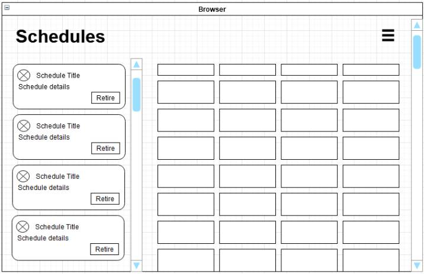

# ◭ Blue Prism UI Tech Test ◭

This test is part of the hiring process at Blue Prism for the Frontend developer position. It should take you a few hours to complete, depending on experience, to implement the minimal version. We've mentioned some bonus points, so feel free to spend some extra time on them if you like.

## Context

Blue Prism is an automation . This test is about (re) building a small part of Blue Prism's main application. You'll use a dedicated API that provides mocked data.

## Exercise

You have been tasked with creating a section of our new Blue Prism Cloud web application. This section of the application allows a user to view a list of schedules for one of the current sessions and its corresponding log entries. It will be using the latest best practices and you are part of that team working on the proof of concept.

We’d like you to build out a simple UI application which will display a list of cards showing the schedules available. When selecting a schedule, it should update the UI to show its currently recorded log entries. There should also be a way to “retire” (archive) and “unretire” (unarchive) a schedule to prevent any further logs. All data will be retrieved from a RESTful API.

It should meet the following use cases:

- As a user I initially get presented with a list of the available schedules.
- As a user I can view a schedule corresponding log entries by selecting its card.
- As a user I can switch a schedule to retired/unretired.

Important: We'd like you to build this small app as you would have done at your current job (UI, UX, testing and documentation).

## Wireframe

The attached is an example wireframe of what the page should look like. The screen is divided into three sections: a header along the top with two vertical sections as the main content. The Schedule cards appear on the left and a table listing the schedule log records appears on the right. Ideally the cards should scroll independently of the table.

The schedule card component lists its details along with a button to allow it to be retired/unretired. Selecting the card, updates the table with its corresponding log entries.

The table simply lists the log entries.

Bonus points will be awarded for options to filter the table and/or cards, semantic HTML, CSS usage, mobile viewport considerations and UI testing. Please don’t be afraid to use new unknown libraries to help you deliver more. We all love to learn new things!

However, doing less “well” is preferable than doing more “less well” 😊 We also appreciate that your free time is important. Therefore, if you feel your code is unfinished, please leave some notes in your README.MD file explaining what you would do next given more time. We are more than happy to review this.

## Mock API

We have supplied a solution that you can use to generate mock data for the test using a mocked JSON server. Please install the npm dependencies `npm i` and start project `npm start`, this in turn will generate the mocked data and host the API on port 3000 by default.

Note: If you make any adjustments to the mocked server project, please provide this project with your solution.

The following endpoints should now be available to retrieve the mock data for the components/views:

To get all available schedules, the data should be available at the following endpoint:

http://localhost:3000/schedules

Likewise, to get all available schedule log entries use:

http://localhost:3000/scheduleLogs

The mock server can accept standard REST requests such as GET, POST, PUT and DELETE. It is also capable of retrieving specific data based on query strings. Please use as necessary.

Full documentation is supplied here: https://github.com/typicode/json-server.

## Toolchain

We are primarily looking at the application code itself – so it's fine to use bundling tools such as Parcel and/or Create React App to bootstrap your build. However, if tooling is your thing, there’s bonus points for rolling your own build system with Webpack, Babel, TypeScript etc.

## Deliverable

Host your solution on a git-based repository and send us the link. It would be great to see it hosted on something like GitHub Pages or Netlify.

Also include a small README.md file detailing how you approached the solution and the tech you decided to use.

We'll try to review it in the next 48 hours and get back to you to talk about your code!

Please don’t hesitate to contact us if you have any questions or require more details.

## Assessment

We will assess the task based on the following criteria.

- Good understanding of the tasks undertaken, and content presented in a clear, understandable format.
- How clean, modular and extensible the code is.
- How it looks visually, and the techniques used to style the application.
- Responsive web design techniques used.
- Accessibility.
- Approach to testing.
- Good understanding of errors and how to handle them.
- Anything that goes above and beyond.

There's flexibility in the review process to consider candidates who have strengths in different areas. Submissions that are very strong on visual design, UX and CSS are equally as valid as those which focus on the underlying code.
